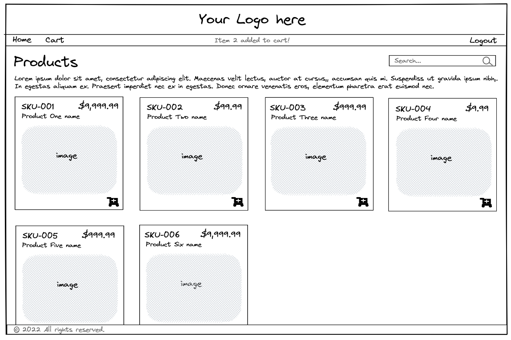
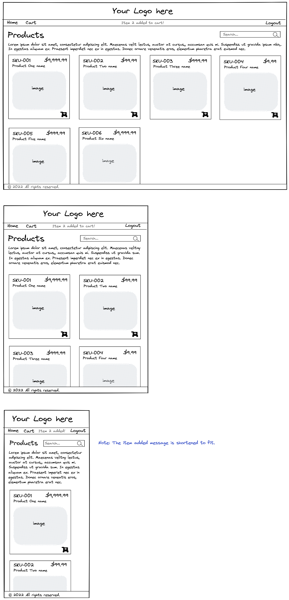

# Module Three Mid-Module Project

## Solar System Geek E-Commerce Application

This application allows a retailer to sell their products to customers in an online setting. Customers can view a list of products or search for a particular item using a built-in search bar. With a click, they can view more information about a product or add the product to a personal cart.

The [Requirements](#requirements) section later in this document describes the application features in greater detail.

Here is a wireframe of the fully functioning website:




### Starting code

Open the Module Three mid-module project `solar` folder in VSCode and review the starting code.

The starting code displays a product set based on hard-coded data in `index.html`. However, the application needs more style and interactivity.

Some essential files to explore:

#### `index.html`

The `<head>` element links all essential stylesheets and scripts. This part of the file requires no modification.

`<section id="product-cards">` contains temporary data describing four cards. Note that these hard-coded cards have different attributes than those you'll eventually generate.

#### `script/productService.js`

`allProducts[]` holds the data for seven products that you need to display in your application. You need to read this array and dynamically generate a set of elements from this data. These elements replace the hard-coded values currently in the `index.html` file.

`getProducts()` returns the `allProducts` array.

You'll add additional methods to this file that return subsets of the `allProducts` array.

#### `script/app.js`

This file has no content save a brief top comment. Use it to:

* Hook up your event handlers.

* Write all methods that define the required behavior of the application.

#### `css/style.css`

Another empty file. Use `style.css` to style the application to match the wireframe images provided.

### Requirements

**Requirement 1: Create header**

Add a `header` element to the top of the page.

The `header` must:

* Display a logo centered on the page
* Always display at the top of the viewport, regardless of scroll position

For the logo, you can insert a placeholder image from [Placeholder.com](https://placeholder.com/). For example, to insert a JPEG image with dimensions 700 pixels by 200 pixels, you can include the following image element:

```html

```

**Requirement 2: Create nav**

Add a `nav` element after the `header` element and before the existing `main` element.

The `nav` must:

* have three links: Home, Cart, and Logout
* left justify the "Home" and "Cart" links
* right justify the "Logout" link
* always display at the top of the viewport, following the `header`

*Tip*: You can assign the `href` attribute for all links as `"#"` so the page doesn't reload when you click a link.

**Requirement 3: Create footer**

Add a `footer` element after the existing `main` element but still within the encompassing `<div id="app">`.

The `footer` must:

* contain the copyright text
* always display at the bottom of the viewport, regardless of the length of the main section

*Tip*: You can copy/paste the copyright symbol from here—`©`—or put `&copy;` in your HTML to have the browser render it.

**Requirement 4: Enable main scrolling**

Style the `main` element to scroll if its content doesn't fit the available space.

**Requirement 5: Style the product card collection**

Style the product card collection. Use `flexbox` to ensure that the cards respond to varying screen widths, as shown in the following images:



**Requirement 6: Style the product cards**

Style the individual product cards. Use `grid` to arrange the information in the product cards like in the sample wireframes.

**Requirement 7: Build cards From data**

Remove the hard-coded cards currently in your HTML. Build cards dynamically from the data in `productService.js`.

Reference the hard-coded HTML to aid you in creating elements. Pay attention to the nesting of elements and their classes. Also, take note of the `data-id` attribute on the hard-coded elements numbered 1-4. Your dynamically generated cards must also have this attribute, each with a unique value.

*Hint*: See [Currency formatting](#currency-formatting) in the Hints section for tips on formatting numbers in JavaScript.

*Hint*: You might not expect to see the cart icon in an `<i>` tag, but that and classes like `fa-solid` and `fa-cart-plus` are how the open source library of icons called **Font Awesome** loads its icons. For more information, see [Font Awesome icons](#font-awesome-icons) in the Hints section.

*Hint*: Use `setAttribute()` to add element attributes. See [Using `setAttribute()` and `getAttribute()`](#using-setattribute-and-getattribute) in the Hints section for more information.

**Requirement 8a: Add an event handler to the product name**

Set up an event handler such that clicking the product name triggers a `window.alert` displaying the product description.

*Hint*: Use `getAttribute()` to identify which product the user clicked. See [Using `setAttribute()` and `getAttribute()`](#using-setattribute-and-getattribute) in the Hints section for more information.

**Requirement 8b: Add an event handler to the shopping cart icon**

Create an event handler such that when the user clicks the shopping cart icon, they receive a `window.alert` notification that the item has been added to the cart.

**Requirement 9: Add a textbox for search**

Add a textbox that allows the user to enter a search term. Then define a method `searchProducts(searchTerm)` in `productService.js`. Use the array `filter` method so that `searchProducts` returns all products equal to or containing the `searchTerm` parameter.

Add the `keyup` event listener to your search bar. Use `searchProducts(searchTerm)` to filter the products list if there's a search term, and `getProducts()` if not.

**Optional**

Upgrade your event handlers from **Requirements 8a and 8b**. Instead of generating a window alert, deliver the appropriate message to a "message window" centered within your `nav`. The message window remains hidden when not displaying a message. Otherwise, the event handlers stay the same:

* Clicking the product name causes the product description to appear in the message window.
* Clicking the shopping cart causes the message window to state that the item has been added to the cart.

---

## Hints

### Currency formatting

To show the product's price in the proper format, you can use the `Intl.NumberFormat` object. `Intl.NumberFormat` accepts `locale` and `options` as arguments. `locale` specifies the region whose formatting rules you want to use. `options` allows you to specify what type of formatting you want to apply to your number.

For example, to display a value in U.S. Dollars (USD):

```javascript
Intl.NumberFormat(`en-US`, {
        currency: `USD`,
        style: "currency",
    }).format(value);
```

For a more extensive description of the capabilities of `Intl.NumberFormat`, check out [Mozilla's documentation](https://developer.mozilla.org/en-US/docs/Web/JavaScript/Reference/Global_Objects/Intl/NumberFormat)

### Font Awesome icons

**Font Awesome** is an open source provider of icons, many of which you can use for free.

You must add their kit to your project to use icons from the Font Awesome library. The `index.html` contains a `stylesheet` link to do this:

```html
<link rel="stylesheet" href="https://cdnjs.cloudflare.com/ajax/libs/font-awesome/6.1.2/css/all.min.css" />
```

With the kit installed, you can choose from [thousands of free icons to add to your site](https://fontawesome.com/search?m=free&o=r). Click on an icon in the search page to reveal various options and the HTML needed to display it on your page.

For example, to display an icon of a heart:


Add the following tag to your HTML:

```html
<i class="fa-regular fa-heart"></i>
```

Font Awesome offers many other icons, including the magnifying glass and shopping cart used in the wireframe solution.

### Using `setAttribute()` and `getAttribute()`

HTML elements can provide more information in the form of **attributes**. For example, the hard-coded product data gives each `product-name` a `data-id` attribute. Each `data-id` has a unique numeric value:

```html
<div class="product-name action" data-id="1">A super product</div>
```

To set an attribute, call the `setAttribute()` method on the element. It takes two parameters—the name of the attribute to set and the value.

Since each value is unique, you can use the `productId` to set each `data-id`:

```javascript
div.setAttribute("data-id", product.productId);
```

You can retrieve an attribute with `getAttribute()`. This method takes one parameter—the attribute name.

You can get the `data-id` to identify which `product-name` the user clicked using the `getAttribute()` method:

```javascript
// Get the id of the target
const id = Number(ev.currentTarget.getAttribute("data-id"));
```
